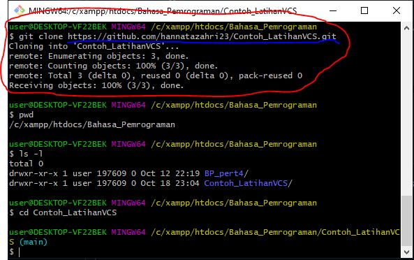
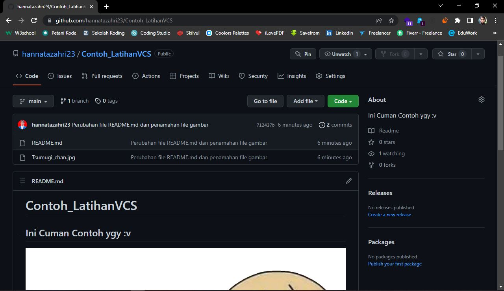

# GIT

## Apa itu git?
* Git adalah salah satu sistem pengontrol versi (Version Control System) pada proyek perangkat lunak yang diciptakan oleh Linus Torvalds.

* VCS atau Version Control System merupakan sebuah sistem yang merekam perubahan-perubahan dari sebuah berkas atau sekumpulan berkas dari waktu ke waktu sehingga Anda dapat melihat kembali setiap perubahannya. Dan Salah satu DVCS (Distributed Version Control System) yang sangat populer saat ini adalah <b style="color: #B8E8FC;">git</b>.

* Pengontrol versi bertugas mencatat setiap perubahan pada file
proyek yang dikerjakan oleh banyak orang maupun sendiri.


## Tutorial Git

### Installasi Git
* Download <b style="color: #B8E8FC;">Git</b> di website resminya melalui link ini (https://git-scm.com/downloads).

* Kemudian unduh Git sesuai dengan arsitektur dan OS komputer kita.

* Setelah itu install Git dengan settingan default saja.

* Selamat!! Git sudah terinstall di PC kalian :smile:, untuk mengetahui Git sudah terpasang atau belum silahkan buka <b style="color: #B8E8FC;">CMD</b> atau <b style="color: #B8E8FC;">Power Shell</b> pada PC kalian, dan ketikan perintah ``` git --version ```.


### Menambahkan Global Config
* Pada saat pertamakali menggunakan Git, kita perlu melakukan konfigurasi <b>user.name</b> dan <b>user.email</b>. Konfigurasi ini bisa dilakukan untuk global repostiry atau individual
repository.

* Apabila belum dilakukan konfigurasi, akan mengakibatkan terjadinya kegagalan saat menjalankan perintah <b>git commit</b>

* Cara melakukan konfigurasinya dengan memasukan dua perintah ini pada Git yang sudah kita install. Buka <b>Git Bash</b> dan masukan perintah ini ``` git config --global user.name "nama_username" ``` dan ``` git config --global user.email "alamat_email" ```.


### Perintah Dasar Git

* `git init`, perintah untuk membuat repository local
* `git add`, perintah untuk menambahkan file baru, atau perubahan pada file pada staging sebelum proses commit.
* `git commit`, perintah untuk menyimpan perubahan kedalam database git.
* `git push -u origin master`, perintah untuk mengirim perubahan pada repository local menuju server repository.
* `git clone [url]`, perintah untuk membuat working directory yang diambil dari repositry sever.
* `git remote add origin [url]`, perintah untuk menambahkan remote server/reopsitory server pada local repositry ``(working directory)``
* `git pull`, perintah untuk mengambil/mendownload perubahan terbaru dari server repository ke local repository

### Praktikum

1. Buatlah <b style="color: #B8E8FC;">Repository Local</b> dengan cara <i>cloning</i> dari <b style="color: #B8E8FC;">Repository Server (Git Hub)</b>. Dengan cara buka website [Git Hub](https://github.com/), dan buatlah sebuah Repository pada Website tersebut. (:bangbang:CATATAN: Harus sudah punya akun Git Hub-nya terlebih dahulu:bangbang:).


2. Kemudian ketikan perintah ```git clone [url]``` pada Git Bash sesuai dengan <b style="color: #B8E8FC;">Link URL</b> pada Repository yang kita buat tadi di Git Hub.


3. Setelah itu buka directory atau folder di tempat kita menyimpan Repo (Repository) Local kita. Dan nanti kita akan menemukan sebuah folder tersembunyi dengan nama <b style="color: #B8E8FC;">.git</b> pada directory kita.

4. Cara melihatnya: pada bagian atas klik view > lalu ceklis pada bagian <b style="color: #B8E8FC;">Hidden items</b>. Dan lanjut buka file <b style="color: #B8E8FC;">README.md</b>-nya lalu isi dengan text sesuai yang kamu inginkan. Untuk tutorial markdown bisa langsung dilihat lewat [GitHub Docs](https://docs.github.com/en/get-started/writing-on-github/getting-started-with-writing-and-formatting-on-github/basic-writing-and-formatting-syntax).


5. Setelah kita rasa cukup untuk pengisian text pada file <b style="color: #B8E8FC;">README.md</b>-nya, lakukan penambahan file pada staging sebelum proses ke <i>commit</i>, dengan cara ketikan perintah ``` git add [nama dir atau file] ``` sesuai dengan nama file atau dir (folder) yang ingin kita tambahkan.


6. Kemudian ketik perintah ``` git commit -m "Isi pesan bebas" ``` untuk menyimpan perubahan ke dalam database Git serta menambahkan pesan perubahannya sebelum di kirim ke Repo Server (GitHub).

7. Setelah itu kirim file/dir perubahannya ke Repo Server dengan cara ketik perintah ``` git push -u origin main ```


8. Dan Sekarang lihat hasilnya..!!

Maaf untuk contoh gambarnya kebesaran :sweat_smile::pray:

### Demikian Tutorial Git dari saya, maaf jika penjelasannya saya masih kurang dipahami :pray: